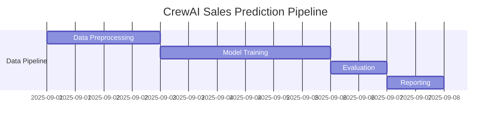

# CrewAI-Powered Sales Prediction Project

## Overview

We leverage **CrewAI** to assemble a team of intelligent agents, each responsible for a specific step in the data science workflow. These agents collaborate seamlessly with data scientists to streamline the end-to-end process.

**Objective:** Predict **units sold** for products using historical sales data, incorporating features like date, product, category, price, discount, and location.

---

## Dataset

| Feature      | Description                   |
| ------------ | ----------------------------- |
| Date         | Sale date                     |
| Product Name | Name of the product           |
| Category     | Product category              |
| Price        | Price of the product          |
| Discount     | Discount applied (if any)     |
| Location     | Store or location of the sale |
| Units Sold   | Target variable – units sold  |

---

## CrewAI Agents & Responsibilities

| Agent                    | Role                                                               |
| ------------------------ | ------------------------------------------------------------------ |
| Data Preprocessing Agent | Cleans, transforms, and prepares raw data for modeling             |
| Model Training Agent     | Trains predictive models using prepared datasets                   |
| Evaluation Agent         | Assesses model performance using metrics like MAE, RMSE, and R²    |
| Reporting Agent          | Generates structured insights, visualizations, and summary reports |

---

## Pipeline Execution Timeline (Gantt Chart)



---

## Sample Python Code for Agents

### 1. Data Preprocessing Agent

```python
import pandas as pd

df = pd.read_csv("sales_data.csv")
df['Date'] = pd.to_datetime(df['Date'])
df.fillna(0, inplace=True)
df = pd.get_dummies(df, columns=['Product Name', 'Category', 'Location'])

print("Data Preprocessing Complete")
```

### 2. Model Training Agent

```python
from sklearn.model_selection import train_test_split
from sklearn.ensemble import RandomForestRegressor

X = df.drop('Units Sold', axis=1)
y = df['Units Sold']
X_train, X_test, y_train, y_test = train_test_split(X, y, test_size=0.2, random_state=42)

model = RandomForestRegressor(n_estimators=100, random_state=42)
model.fit(X_train, y_train)

print("Model Training Complete")
```

### 3. Evaluation Agent

```python
from sklearn.metrics import mean_absolute_error, mean_squared_error, r2_score
import numpy as np

y_pred = model.predict(X_test)

mae = mean_absolute_error(y_test, y_pred)
rmse = np.sqrt(mean_squared_error(y_test, y_pred))
r2 = r2_score(y_test, y_pred)

print(f"MAE: {mae}, RMSE: {rmse}, R²: {r2}")
```

### 4. Reporting Agent

```python
import matplotlib.pyplot as plt

# Sales Trend
plt.figure(figsize=(10,5))
plt.plot(df['Date'], df['Units Sold'], label='Actual Sales')
plt.plot(df['Date'], model.predict(df.drop('Units Sold', axis=1)), label='Predicted Sales')
plt.xlabel('Date')
plt.ylabel('Units Sold')
plt.title('Sales Trend Over Time')
plt.legend()
plt.show()

# Units Sold by Category
category_sales = df.groupby('Category')['Units Sold'].sum()
category_sales.plot(kind='bar', title='Units Sold per Category')
plt.show()

# Price vs Units Sold
plt.scatter(df['Price'], df['Units Sold'])
plt.xlabel('Price')
plt.ylabel('Units Sold')
plt.title('Price vs Units Sold')
plt.show()
```

---

## Sample Outputs

### KPIs

| Metric                     | Value  |
| -------------------------- | ------ |
| MAE                        | 12.5   |
| RMSE                       | 18.3   |
| R²                         | 0.87   |
| Total Predicted Units Sold | 15,230 |

## Conclusion

Using **CrewAI**, we created an intelligent, modular pipeline for predicting unit sales. Each agent handles a specific task—from preprocessing to reporting—enabling faster insights, more accurate predictions, and better collaboration with data scientists.
