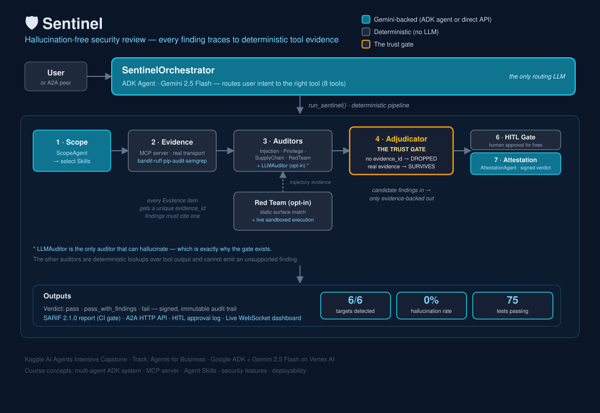

# 🛡️ Sentinel — Hallucination-Free Security Review for Vibe-Coded Agents

> **Every finding Sentinel reports traces to deterministic tool evidence.  
> Hallucinated findings are automatically dropped by the Adjudicator.**

Kaggle AI Agents Intensive Capstone · Track: **Agents for Business**  
Built with Google ADK + Gemini 2.5 Flash on Vertex AI

---

## The Problem

Vibe coding ships agents at unprecedented speed — and ships them vulnerable: prompt injection surfaces, confused-deputy privilege leaks, secrets in logs, dependency CVEs, unsafe `eval()` of model output.

The obvious fix — point an LLM at the code and ask "is this secure?" — fails the moment it matters: **LLM reviewers hallucinate findings**, so teams can't trust the output, so they ignore it.

Sentinel solves this at the architecture level, not the prompt level.

---

## The Innovation: The Evidence Gate

Every finding produced by Sentinel's specialist auditors must reference at least one `evidence_id` from the deterministic evidence store (bandit, ruff, pip-audit, semgrep). An **Adjudicator agent** deletes any finding that can't prove itself.

```
Finding with no evidence_ids → DROPPED
Finding with fake evidence_ids → DROPPED  
Finding with real evidence_ids → SURVIVES
```

This eliminates hallucinated security findings structurally — not by asking the model nicely, but by making it architecturally impossible to emit an unsupported finding.

**Note on the auditors:** the four deterministic specialists (Injection, Privilege, Supply Chain, RedTeam) are lookup tables over tool output — they never *can* hallucinate, so the gate is defense-in-depth for them. The **LLM Auditor** (`sentinel/agents/llm_auditor.py`, opt-in via `--llm-auditor` / `review_with_llm_auditor`) is different: it reads the raw source and reasons freely, which means it *can* propose a finding with a fabricated `evidence_id`. That's the auditor whose output the gate actually has to defend against.

**The gate measured live, not just claimed.** `python -m sentinel.eval.llm_gate_report` runs the LLM auditor against every corpus target with real Vertex AI credentials and reports exactly how many candidates it proposed vs. how many survived the Adjudicator:

| Target | Proposed | Survived | Dropped |
|---|---|---|---|
| T1 — Injection | 2 | 2 | 0 |
| T2 — Privilege Leak | 3 | 2 | **1** |
| T3 — Secret Leak | 4 | 4 | 0 |
| T4 — SQL Injection | 2 | 2 | 0 |
| T5 — Unsafe Deserial | 3 | 3 | 0 |
| T6 — SSRF | 4 | 3 | **1** |
| C1 / C2 — Clean | 0 | 0 | 0 |
| **Total** | **18** | **16** | **2** |

The 2 drops weren't fabricated evidence — Gemini cited real evidence both times. It wrote `severity: "medium"` instead of the schema's required literal `"med"`, and the Adjudicator rejected the candidate outright (Pydantic schema validation, not just the evidence check). That's arguably a *better* demonstration than a clean hallucination: it shows the gate enforces the **entire** Finding contract, not just the evidence_id field, and that even a well-instructed model drifts on exact-string requirements often enough that structural validation — not prompting — is what should be trusted. For the harder, deliberately-adversarial case (a candidate that cites a *fabricated* `evidence_id`), see the mocked, offline-reproducible proof in `tests/test_llm_auditor.py::test_llm_hallucinated_evidence_id_is_dropped_by_gate` and `tests/test_adjudicator.py::test_finding_with_fake_evidence_id_is_dropped`.

---

## Results

| Metric | Value |
|---|---|
| Target detection rate | **100%** (6/6 vulnerable targets detected, including a bandit blind spot) |
| LLM-auditor evidence survival rate (live, measured) | **89%** (16/18 candidates; the 2 dropped were schema violations, not hallucinated evidence) |
| Hallucinated-finding rate on clean controls | **0%** |
| False positives on clean controls | **0** (C1 and C2 both pass with zero findings) |
| Tests passing | **73** |
| Course concepts demonstrated | **6 / 6** |

---

## Architecture



**A multi-agent ADK system where the LLM agents sit at the boundaries and every load-bearing step is deterministic.** This split is the design, not an accident: LLM agents handle the parts where reasoning and explanation help — the orchestrator the user talks to, the Scope agent that profiles a target, the Attestation agent that interprets and signs the verdict, and the opt-in LLM auditor — while the parts that must be *trusted* (evidence collection, the auditors' evidence→finding mapping, the adjudication gate itself) are plain deterministic Python. *Why Sentinel puts the LLM on a leash:* in a security tool, trust comes from determinism, not from a model promising it didn't hallucinate. The agents reason about and around the evidence; they never get to invent it.

```
SentinelOrchestrator (ADK Agent, Gemini 2.5 Flash) ── routes user intent to the right tool
│   8 tools: 5 end-to-end reviews · profile_target · produce_attestation · get_agent_capabilities
│
├─ ScopeAgent        (ADK Agent) ──tool──► profile_target()        → select Skills
│
└─► run_sentinel() — deterministic pipeline:
    │
    ├─ 1. Scope          Profile target → select Skills            (skill_loader, pure fn)
    ├─ 2. Evidence       Call MCP tools over real MCP transport    (evidence_agent, NO LLM)
    ├─ 3. Auditors       Map evidence → candidate findings:
    │     ├─ InjectionAuditor    (prompt-injection-defense SKILL)  — deterministic
    │     ├─ PrivilegeAuditor    (confused-deputy-iam SKILL)       — deterministic
    │     ├─ SupplyChainAuditor  (supply-chain-integrity SKILL)    — deterministic
    │     ├─ RedTeamAuditor      (consumes trajectory evidence)    — deterministic
    │     └─ LLMAuditor          (opt-in, Gemini)  — the ONLY auditor that CAN hallucinate
    ├─ 4. Red Team       Fire 8 adversarial payloads → trajectory evidence
    │     ├─ static  (sentinel/redteam/runner.py)       — textual surface match
    │     └─ live    (sentinel/redteam/live_runner.py)  — sandboxed real execution, opt-in
    ├─ 5. Adjudicator    ← THE TRUST GATE: drop findings without evidence  (adjudicate, pure fn)
    ├─ 6. HITL Gate      Pause before high-severity auto-remediation       (HITLGate)
    └─ 7. Attestation    Risk-stratified verdict + signed audit trail      (Attestation model)
│
└─ AttestationAgent  (ADK Agent) ──tool──► produce_attestation()   → runs adjudicate(), signs verdict
```

**ADK agents:** `SentinelOrchestrator` (`sentinel/orchestrator/agent.py`), `ScopeAgent` (`sentinel/agents/scope_agent.py`), `AttestationAgent` (`sentinel/agents/attestation_agent.py`), and the opt-in `LLMAuditor` (`sentinel/agents/llm_auditor.py`). The Scope and Attestation agents wrap deterministic tools (`profile_target` → skill selection; `produce_attestation` → the adjudicator gate), so they can *explain* a stage without being able to alter its deterministic result — and they're exposed as orchestrator tools so the full pipeline and each stage are independently drivable. The auditors and evidence collection (stages 2–4) stay pure functions on purpose.

**Live red team** (`--live-red-team`, opt-in, off by default) actually executes the corpus payloads against the target's real functions instead of only checking for static surfaces — e.g. it really calls `eval()` on an adversarial string and really fires a `subprocess` gadget, then reports what happened. Containment, not honor system:
- Every (function, payload) pair runs in its **own subprocess**, spawned by `sentinel/redteam/_live_worker.py` — target code is never imported in the main Sentinel process.
- The subprocess gets a **disposable temp directory as cwd** (file writes/deletes land there, then it's deleted), a **scrubbed environment** (no inherited credentials), **network sockets patched to raise** before the target module is even imported (covers DNS resolution and the connect step — verified against a real domain, not just a fake one), a **hard timeout**, and (POSIX) **CPU/memory rlimits**.
- Only functions whose first required parameter is free-form text (str/bytes) **and not named like a path** (`path`/`dir`/`file`/`filename`) are ever called with a raw payload — enforced inside the worker, so an adversarial string can never reach a filesystem-path parameter.
- Restricted to the same scan-root allow-list the MCP evidence server enforces — this is for the bundled, trusted target corpus, not arbitrary third-party code.
- See `sentinel/redteam/live_runner.py`'s module docstring for the full model, and `tests/test_live_redteam.py` for the containment proofs (no files leak into the real repo, path-like params are never called, traversal is blocked, network-blocked outcomes don't count as confirmed).

**MCP Evidence Server** (FastMCP, called over its real in-process MCP transport) wraps deterministic tools:
- `security_scan` — bandit (eval, subprocess, pickle, SQL injection, hardcoded secrets)
- `lint_scan` — ruff (style and error findings with line locators)
- `dependency_scan` — pip-audit (dependency CVEs)
- `semgrep_scan` — semgrep, combining two registry packs (`p/python`, `p/gitleaks`) with **project-authored rules** in `sentinel/mcp/semgrep_rules/agent_security.yaml`:
  - `sentinel-ssrf-unvalidated-url` — flags `requests.get/post/put` called with a non-literal URL (data-flow pattern; bandit has **no rule for this at all**)
  - `sentinel-llm-api-key-hardcoded` — matches known LLM/cloud key *value formats* (`sk-...`, `AIza...`, `ya29...`) regardless of variable name, closing a real gap in bandit's name-based heuristic (bandit's word list is `password|pass|passwd|pwd|secret|token` — notably not `key`)
  - **Proven, not asserted:** `targets/t6_ssrf` is a target bandit genuinely cannot flag for its seeded vulnerabilities — confirmed by `tests/test_semgrep_detection.py::test_bandit_finds_nothing_relevant_on_t6`. Only semgrep catches it, and the full pipeline's findings on T6 trace exclusively to semgrep evidence (`test_full_pipeline_catches_t6_via_semgrep_only`). This is the concrete answer to "doesn't this just wrap bandit?" — semgrep raises the detection ceiling, demonstrably.
  - Degrades gracefully (empty findings, not a crash) if semgrep isn't installed or its registry packs can't be fetched — it's additive evidence, not a hard dependency. See "Offline / no-network use" below.
- Every tool validates `target_path` against an allowed scan root and file-count/size limits before touching the filesystem — see `_validate_target` in `sentinel/mcp/evidence_server.py`.

**Offline / no-network use:** `p/python` and `p/gitleaks` are fetched from semgrep's registry on first use and cached locally afterward (subsequent scans are offline). If there's truly no network ever, `semgrep_scan` still runs the project's own rules (a local file, no fetch needed) and silently skips the registry packs — bandit/ruff/pip-audit are unaffected either way.

**Agent Skills** — domain expertise as composable `SKILL.md` modules:
- `prompt-injection-defense` — injection surfaces, eval, subprocess
- `confused-deputy-iam` — credential forwarding, hardcoded secrets
- `supply-chain-integrity` — dependency vulnerabilities

**A2A** — Sentinel publishes an agent card at `/.well-known/agent-card.json` and exposes a task-based HTTP API for remote agent-to-agent review requests. Bearer-token auth is opt-in (`SENTINEL_A2A_TOKEN`); completed tasks are purged after `SENTINEL_TASK_TTL_SECONDS` (default 1h).

**CI integration** — `python -m sentinel.pipeline <target> --sarif report.sarif.json --fail-on fail` runs headless and exits non-zero on a failing verdict, for wiring into a CI security gate.

---

## Course Concepts Demonstrated

The rubric requires demonstrating **at least 3** of these. Sentinel demonstrates 4 in code alone (the first four below), independent of the video:

| Concept | Status | Where |
|---|---|---|
| Agent / multi-agent system (ADK) | ✅ Code | Four ADK agents: orchestrator (`orchestrator/agent.py`), Scope (`agents/scope_agent.py`), Attestation (`agents/attestation_agent.py`), opt-in LLM auditor (`agents/llm_auditor.py`) — Scope/Attestation are wired as orchestrator tools |
| MCP Server | ✅ Code | `sentinel/mcp/evidence_server.py` (4 tools, called over real MCP transport) |
| Agent Skills | ✅ Code | `sentinel/skills/` (3 composable `SKILL.md` modules + loader) |
| Security features | ✅ Code | The whole project — `adjudicator.py` evidence gate, `redteam/` sandboxed live execution |
| Deployability | ✅ Video | `deploy/Dockerfile` + `deploy/deploy.sh` → Cloud Run (shown in demo video) |

> **Antigravity:** demonstrated in the video if used to build the project — *not claimed here unless it's genuinely part of the build story.* Sentinel already meets the 3-concept bar with the four code concepts above, so this is optional, not load-bearing.

**Bonus beyond the required concepts:** A2A agent card + HTTP endpoint (optional bearer auth), HITL gate, static **and** sandboxed-live trajectory evaluation, SARIF/CI-gate integration.

---

## Eval Corpus

| Target | Seeded Vulnerability | Caught By | Detected | Verdict |
|---|---|---|---|---|
| T1 | eval() + subprocess shell=True | bandit + semgrep | ✅ | FAIL |
| T2 | Hardcoded API key/password | bandit | ✅ | FAIL |
| T3 | Hardcoded secrets/credentials | bandit + semgrep (gitleaks) | ✅ | FAIL |
| T4 | SQL injection via string concat | bandit | ✅ | FAIL |
| T5 | pickle deserialization + subprocess | bandit | ✅ | FAIL |
| T6 | SSRF + hardcoded LLM key (by value format) | **semgrep only — bandit catches neither** | ✅ | FAIL |
| C1 | None (clean control) | — | ✅ | PASS |
| C2 | None (clean control) | — | ✅ | PASS |

T6 is the load-bearing row: it's not a third detector finding the same things bandit already finds, it's proof the detection ceiling genuinely moved. See `tests/test_semgrep_detection.py`.

---

## Quick Start

### Prerequisites
- Python 3.11+
- Google Cloud account with Vertex AI enabled
- `gcloud` CLI installed

### Setup

```bash
git clone https://github.com/sergiunicoara/Agentic-AI
cd Agentic-AI/Sentinel
python -m venv venv

# Windows
venv\Scripts\activate
# Mac/Linux
source venv/bin/activate

uv pip install -r requirements.txt
```

### Authenticate (no API key needed)

```bash
gcloud auth application-default login
```

### Environment

Create `.env` in the `Sentinel/` folder:

```
GOOGLE_GENAI_USE_VERTEXAI=TRUE
GOOGLE_CLOUD_PROJECT=your-gcp-project-id
GOOGLE_CLOUD_LOCATION=global
```

### Run the agent

```bash
adk run sentinel/orchestrator
```

Then ask:
```
Review the target at targets/t1_injection
Review the target at targets/t1_injection with red team enabled
Review the target at targets/t1_injection with live red team execution
Review the target at targets/t1_injection with the LLM auditor enabled
Request remediation approval for targets/t1_injection
Show me your agent capabilities
```

### Run the eval corpus

```bash
python -m sentinel.eval.runner
```

### Run the LLM gate report (the quantified "proposed vs. survived" table above)

```bash
python -m sentinel.eval.llm_gate_report   # requires Vertex AI credentials
```

### Run tests

```bash
pytest tests/ -v
```

The suite takes several minutes (observed 5–11 min depending on machine/network) — most pipeline-level tests now run the full evidence collection (bandit + ruff + pip-audit + semgrep) per target, and semgrep's own startup/rule-fetch cost dominates and varies with network conditions. This is a deliberate thoroughness-over-speed tradeoff for a security tool's test suite, not an oversight.

### Run from the CLI (CI-friendly)

```bash
python -m sentinel.pipeline targets/t1_injection
python -m sentinel.pipeline targets/t1_injection --red-team --sarif report.sarif.json
python -m sentinel.pipeline targets/t1_injection --live-red-team   # sandboxed real execution
python -m sentinel.pipeline targets/t1_injection --llm-auditor   # requires Vertex AI credentials
```

Exits non-zero when the verdict meets `--fail-on` (default `fail`) — wire this into a CI security gate.

### Start the A2A server

```bash
python -m sentinel.a2a.server
```

Agent card available at: `http://localhost:8080/.well-known/agent-card.json`

Set `SENTINEL_A2A_TOKEN` to require `Authorization: Bearer <token>` on review endpoints (unset by default for local demo use).

---

## Project Structure

```
Sentinel/
├── sentinel/
│   ├── orchestrator/       # ADK root agent + 8 tools (incl. scope & attestation agents' tools)
│   ├── agents/             # EvidenceAgent, 5 auditors, Adjudicator, HITL gate
│   ├── mcp/                # FastMCP evidence server (bandit, ruff, pip-audit, semgrep) + path/size guard
│   │   └── semgrep_rules/  # Project-authored rules: SSRF, LLM-key-by-value-format
│   ├── models/             # Pydantic schemas (Evidence, Finding, Attestation, pillar taxonomy)
│   ├── skills/             # 3 SKILL.md domain expertise modules
│   ├── redteam/            # 8-payload corpus + static runner + sandboxed live runner
│   ├── a2a/                # Agent card, A2A server (optional auth + TTL eviction), A2A client
│   └── eval/               # Eval runner + metrics + SARIF export + LLM gate report
├── targets/                # Planted-bug corpus (T1–T6, C1, C2 — T6 is bandit's blind spot)
├── tests/                  # 73 tests across all components
├── deploy/                 # Dockerfile + Cloud Run deploy script
├── hello_agent/            # ADK hello-world (setup verification)
├── requirements.txt
├── pyproject.toml
└── .env                    # Not committed — see Environment section above
```

---

## Deploy to Cloud Run

Run from the `Sentinel/` repo root (the script resolves the build context itself):

```bash
chmod +x deploy/deploy.sh
./deploy/deploy.sh
```

Or manually — note `-f deploy/Dockerfile` with the **repo root** as the build context, so `requirements.txt` and the `sentinel/` package are included (and `.dockerignore` keeps `.env` out of the image):

```bash
docker build -f deploy/Dockerfile -t gcr.io/recruiter-sergiu-260213/sentinel:latest .
docker push gcr.io/recruiter-sergiu-260213/sentinel:latest
gcloud run deploy sentinel \
  --image gcr.io/recruiter-sergiu-260213/sentinel:latest \
  --platform managed \
  --region us-central1 \
  --allow-unauthenticated
```

> For anything beyond a demo, set `SENTINEL_A2A_TOKEN` on the service and drop `--allow-unauthenticated`, or the review endpoints are open to the internet.

---

## The Self-Review Demo

Sentinel can review its own code:

```
adk run sentinel/orchestrator
> Review the target at sentinel/mcp
```

This is the defining moment: the harness reviewing itself, finding real issues in its own code, with every finding backed by deterministic evidence.

Sentinel consistently flags a real issue in its own MCP evidence server — bandit B603 (`subprocess call without shell, but evaluating a value from elsewhere`), since `_run()` wraps tool subprocesses — and returns `PASS_WITH_FINDINGS`. (The exact `evidence_id` is a fresh UUID fragment each run, e.g. `ev_bandit_613a52da` — don't expect that literal string to reproduce; the finding itself does.) The finding is backed by deterministic evidence. No hallucination. The harness reviewing itself and finding a genuine issue is the system working exactly as designed.

---

## Security Note

No API keys are stored in this repository. Authentication uses Google Cloud Application Default Credentials (`gcloud auth application-default login`). Never commit `.env` files or credential files.

---

## Author

**Sergiu Nicoară** — AI Engineer  
GitHub: [sergiunicoara](https://github.com/sergiunicoara)  
LinkedIn: [sergiu-nicoara-31b27013](https://www.linkedin.com/in/sergiu-nicoara-31b27013/)
