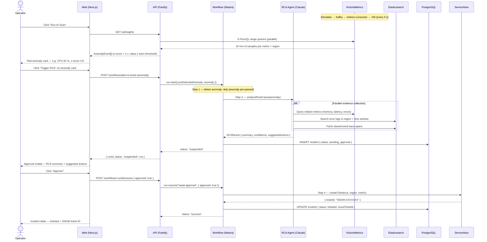
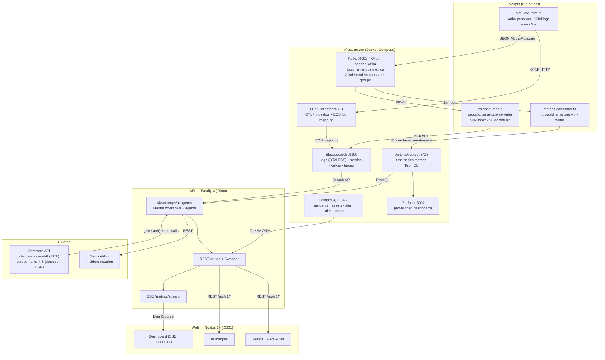

# SmartOps AI Observability Platform

A full-stack AI-powered observability platform built as a pnpm + Turborepo monorepo. It unifies metrics, logs, and traces into a single dashboard, and uses Mastra AI agents to detect anomalies, run root-cause analysis, and auto-create ServiceNow tickets through a human-in-the-loop approval workflow.

---

## Architecture

```
apps/
  api/          Fastify REST API — auth, RBAC, metrics/logs/traces routes, SSE streaming
  web/          Next.js 14 dashboard — real-time charts, alert rules, asset registry, AI insights
  ai-agents/    Mastra agent suite — anomaly detection, RCA, forecasting, ServiceNow workflow

packages/
  shared-types/ Zod schemas and TypeScript types shared across api + web

infra/
  docker/       Docker Compose — brings up the full observability stack locally
  helm/         Helm chart for Kubernetes deployment
  grafana/      Provisioned dashboards (golden signals, log explorer, asset audit)
  otel/         OTel Collector config (OTLP → Elasticsearch, ECS log mapping)
  vector/       Vector log pipeline (Docker container logs → Elasticsearch)
  victoria/     VictoriaMetrics scrape config + VMAlert rules

e2e/            Playwright end-to-end test suite
scripts/
  simulate-infra.ts    Kafka producer — publishes JSON metric events, pushes OTel logs
  metrics-consumer.ts  Consumer group smartops-vm-writer → VictoriaMetrics remote-write
  es-consumer.ts       Consumer group smartops-es-writer → Elasticsearch bulk index
```

---

## Incident Response Workflow

The core feature: anomaly detection → AI root-cause analysis → human approval → ServiceNow ticket, implemented as a Mastra suspend/resume workflow.



---

## System Architecture



---

## Tech Stack

| Layer | Technology |
|---|---|
| API | Fastify 4, Drizzle ORM, PostgreSQL 16, JWT |
| Frontend | Next.js 14 App Router, Tailwind CSS, Recharts, SWR |
| AI Agents | Mastra, Anthropic Claude (`@ai-sdk/anthropic`) |
| Message broker | Kafka (apache/kafka, KRaft, no ZooKeeper) — metric fan-out to VM + ES |
| Metrics | VictoriaMetrics + VMAlert + Alertmanager |
| Logs & Traces | Elasticsearch 8 + OTel Collector (ECS mapping) + Vector pipeline |
| Telemetry | OpenTelemetry Collector (OTLP gRPC :4317 / HTTP :4318) |
| Dashboards | Grafana 10 (provisioned, reads from VictoriaMetrics) |
| Monorepo | pnpm workspaces + Turborepo |
| E2E | Playwright |
| K8s | Helm chart (`infra/helm/smartops/`) |

---

## Getting Started

### Prerequisites

- Node.js ≥ 20
- pnpm ≥ 9 (`npm i -g pnpm`)
- Docker + Docker Compose

### 1. Install dependencies

```bash
pnpm install
```

### 2. Configure environment

```bash
cp .env.example .env
cp apps/web/.env.local.example apps/web/.env.local
# Fill in ANTHROPIC_API_KEY
```

### 3. Start the infrastructure stack

```bash
pnpm stack:up
```

Starts VictoriaMetrics, VMAlert, Alertmanager, Elasticsearch, PostgreSQL, Grafana, OTel Collector, and Vector.

### 4. Run database migrations

```bash
pnpm db:migrate
```

### 5. Start the apps

```bash
pnpm dev          # all apps in parallel
pnpm dev:api      # Fastify on :3000
pnpm dev:web      # Next.js on :3001
```

### 6. Start the metric pipeline (three terminals)

```bash
# Terminal A — Kafka producer: publishes JSON metric events + OTel logs
pnpm simulate

# Terminal B — VictoriaMetrics consumer: reads topic → remote-write to VM
pnpm simulate:consumer

# Terminal C — Elasticsearch consumer: reads topic → bulk-index to smartops-metrics-*
pnpm simulate:es-consumer
```

The simulator publishes a `MetricMessage` to the `smartops.metrics` Kafka topic every 5 seconds per region. The two consumers read from independent consumer groups — stopping one doesn't affect the other. OTel logs go directly from the simulator to the OTel Collector (port 4318) and land in Elasticsearch under `smartops-logs` with ECS field mapping.

---

## Service URLs

| Service | URL | Credentials |
|---|---|---|
| API | http://localhost:3000 | — |
| Swagger | http://localhost:3000/api/docs | — |
| Web dashboard | http://localhost:3001 | `admin@smartops.local` / `smartops_dev` |
| Grafana | http://localhost:3002 | `admin` / `smartops_dev` |
| Kafka broker | localhost:9092 | — (no UI; use `kafka-topics.sh --bootstrap-server localhost:9092 --list`) |
| VictoriaMetrics | http://localhost:8428 | — |
| Elasticsearch | http://localhost:9200 | — |
| Alertmanager | http://localhost:9093 | — |
| OTel Collector (HTTP) | http://localhost:4318 | — |

---

## AI Agents

The `@smartops/ai-agents` workspace package exposes four Mastra agents:

| Agent | Model | Role |
|---|---|---|
| `anomalyDetector` | `claude-haiku-4-5` | Natural-language reasoning on metric ranges (fast path uses z-score math without LLM) |
| `rootCauseAnalyzer` | `claude-sonnet-4-6` | Correlates metrics + logs + traces into a root-cause narrative |
| `forecastingAgent` | `claude-haiku-4-5` | Forecasts metric trends from historical PromQL data |
| `servicenowAgent` | `claude-haiku-4-5` | Structures RCA output into a ServiceNow incident payload |

The `alertToTicket` workflow chains these agents as four steps with a suspend/resume gate before the ticket is created.

---

## Architectural Considerations

These are the design decisions I'd defend, the trade-offs I accepted knowingly, and the things I'd change with more time.

### 1. Deterministic detection before probabilistic reasoning

The fast detection path — `detectAnomalies()` — is pure z-score math: no LLM, no network call to Anthropic, no latency beyond the VictoriaMetrics query. The LLM only runs when an anomaly is already confirmed. This keeps the happy path cheap: 6 parallel metric queries, each under 100 ms, and zero AI cost when everything is healthy.

The z-score threshold (> 2 standard deviations, above the warning floor) is intentionally conservative. Chasing a lower false-negative rate by lowering the threshold would push work to the RCA agent on every minor fluctuation, which compounds cost and alert fatigue. The absolute backstop — always flag values ≥ 85% CPU regardless of history — handles the cold-start problem where there isn't enough baseline data for a meaningful z-score yet.

### 2. Human-in-the-loop as a structural guarantee, not a UI convention

The workflow suspends mid-execution at the `await-approval` step. There is no code path through which a ServiceNow ticket gets created without a human calling the `/resume` endpoint. This is enforced at the Mastra execution model level, not by a feature flag or an `if (autoApprove)` check that could drift or be misconfigured.

Mastra's `suspend()` throws internally to halt the step — it's not a conditional return. The workflow state is persisted and the run ID is stored in PostgreSQL. Even if the API process restarts between the anomaly detection and the human decision, the approval endpoint can resume the correct workflow run from its persisted state.

### 3. Pre-detected anomaly pass-through avoids a race condition

The simulator injects CPU spikes that last 25 seconds. If the workflow re-ran `detectAnomalies()` internally after the user clicked "Trigger RCA," there is a meaningful probability the spike would have resolved before that query executed — and the workflow would return "no anomaly found," silently doing nothing.

The fix: `detectAnomalyStep` accepts an optional `preDetectedAnomaly` field. When present, it returns immediately without querying VictoriaMetrics. The anomaly captured at scan time is the anomaly that gets analyzed. This pattern generalises: any trigger source — a webhook, a CLI call, an alert rule — can inject a pre-validated anomaly event and skip re-detection.

### 4. Graceful degradation over hard infrastructure dependencies

Both Elasticsearch and the trace-fetching tool are wrapped in `withFallback()` — a helper that races the call against a 5-second timeout and catches immediate errors (connection refused) and hangs alike. If Elasticsearch is down, the RCA agent receives empty log and trace results and writes a lower-confidence analysis from metric evidence only. The workflow does not fail.

This is a deliberate trade-off: some incidents will get incomplete RCA when a data source is unavailable, but the pipeline stays running. The confidence score (0.0–1.0, surfaced in the approval modal) communicates data quality to the human reviewer honestly. Low confidence is signal, not silence.

### 5. VictoriaMetrics as the single time-series source of truth

Both the SmartOps anomaly detector and Grafana read from the same VictoriaMetrics PromQL endpoint. There is no ETL, no sync, no divergence between what Grafana shows and what the AI analyzed. When an operator approves a ticket and then looks at the Grafana dashboard, they're looking at the same data — which matters for incident retrospectives.

VictoriaMetrics over Prometheus: same PromQL API (zero Grafana migration cost), 10–40× better compression, no cardinality bombs, single binary, no pushgateway needed for short-lived jobs.

### 6. `@smartops/ai-agents` as an independent workspace package

The agent logic lives in a separate pnpm workspace package rather than inside the API server's `src/`. This means any future consumer — a CLI tool, a Slack bot, a separate worker process — can import `@smartops/ai-agents` directly without pulling in Fastify. It also makes the AI layer independently testable: the agent tests in `src/__tests__/` don't need an HTTP server running.

The boundary also enforces discipline: the API server cannot reach into Mastra internals directly, it can only call the exported functions (`detectAnomalies`, `analyzeRootCause`, the Mastra instance). Agent implementation details stay private to the package.

### 7. SSE over WebSockets for dashboard streaming

The dashboard metrics stream is unidirectional: the server pushes snapshots, the browser only receives. SSE maps to this shape exactly — one long-lived HTTP response, built-in reconnect (the browser retries automatically on disconnect), works through HTTP/2 multiplexing without protocol negotiation. WebSocket would add connection management complexity, a custom keepalive, and a separate handshake for a pattern that HTTP already handles well.

The one limitation: SSE is text-only. If the metrics payload grew to the point where binary encoding mattered, that would be the trigger to revisit.

### 8. What I'd change with more time

**Add a Kafka Schema Registry.** The `MetricMessage` contract between the simulator and both consumers is currently a TypeScript interface shared by convention — nothing enforces schema compatibility at runtime. A Schema Registry (Confluent or Redpanda) with Avro or Protobuf would catch breaking changes before they reach consumers in production, and enable schema evolution without coordinated deploys.

**Instrument the agent calls with OpenTelemetry.** The API is already wired to the OTel Collector. Wrapping each `agent.generate()` call in an OTel span would produce traces showing LLM latency, tool call counts, and retry attempts — making the AI layer observable with the same tooling as the rest of the platform. Currently the Claude calls are a black box inside an observability platform, which is an irony worth fixing.

**Replace in-process Mastra state with a Redis-backed workflow store.** SQLite is fine for a single-process local setup. For horizontal scaling — multiple API instances behind a load balancer — the workflow state needs to be shared so any instance can resume a suspended run. Mastra supports external storage backends; wiring up Redis or a Postgres-backed store would be the production path.

**Add a dead-letter topic for failed consumer messages.** Both Kafka consumers silently re-queue on ES/VM errors. A dead-letter topic (`smartops.metrics.dlq`) would capture failed messages for inspection and replay without blocking the main consumer group — standard production Kafka practice.

---

## Scripts

```bash
pnpm dev                  # Run all apps in watch mode
pnpm build                # Build all packages
pnpm typecheck            # TypeScript check across all packages
pnpm lint                 # Lint all packages
pnpm simulate             # Kafka producer: publishes metric events + OTel logs
pnpm simulate:consumer    # Kafka consumer → VictoriaMetrics remote-write
pnpm simulate:es-consumer # Kafka consumer → Elasticsearch bulk index
pnpm db:generate          # Generate Drizzle migrations
pnpm db:migrate           # Apply migrations
pnpm stack:up             # Start Docker Compose infrastructure (includes Kafka)
pnpm stack:down           # Stop infrastructure
pnpm stack:logs           # Tail infrastructure logs
```

---

## E2E Tests

```bash
cd e2e
pnpm install
pnpm exec playwright test
```

Covers auth, dashboard, assets, and AI agent flows.

---

## Architecture Decision Records

- [ADR-001: pnpm Workspaces + Turborepo](docs/adr/001-monorepo-with-turborepo.md)
- [ADR-002: Mastra HITL Workflow](docs/adr/002-mastra-hitl-workflow.md)
- [ADR-003: VictoriaMetrics over Prometheus](docs/adr/003-victoriametrics-over-prometheus.md)
- [ADR-004: SSE for Real-time Metrics](docs/adr/004-sse-for-realtime-metrics.md)

## Runbooks

- [Incident Response](docs/runbooks/incident-response.md)
- [Scaling](docs/runbooks/scaling.md)
