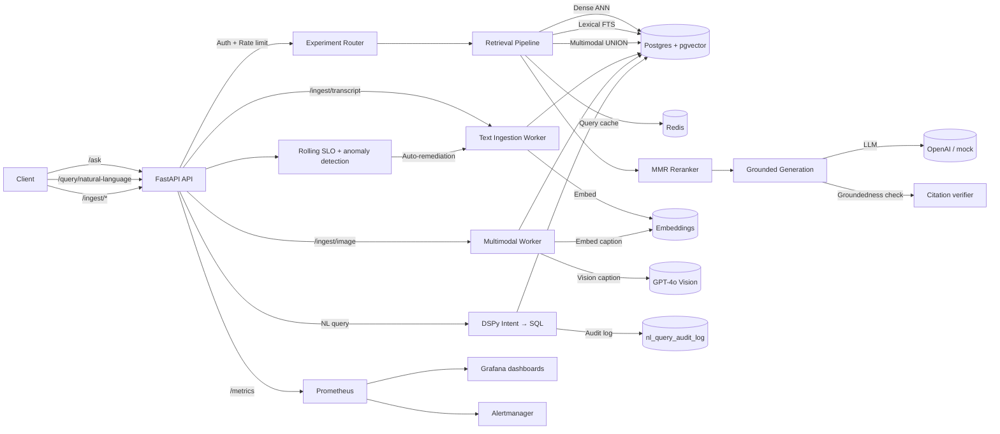

# AI-Native Data Platform

Production-grade RAG platform scaffold demonstrating the engineering patterns used in real AI-native systems: multi-stage retrieval, multimodal ingestion, runtime reliability contracts, DSPy-optimized NL→SQL, and a full Prometheus + Grafana observability stack.

## What's inside

| Subsystem | What it does |
|---|---|
| **Text ingestion** | Idempotent chunking + embedding, chunk-level hash dedup, embedding version tags |
| **Multimodal ingestion** | PDF/image → GPT-4o Vision captions → embeddings stored in `image_chunk` |
| **Retrieval stack** | Dense (pgvector ANN) + lexical (Postgres FTS) + hybrid fusion (RRF) + MMR reranking |
| **Grounded generation** | Strict JSON schema outputs, citation snippet verification, minimum evidence gate |
| **Reliability contracts** | Runtime SLO guardrails (latency, empty-retrieval, groundedness), rolling window SLO, EWMA anomaly detection, leader-elected automated remediation |
| **NL→SQL layer** | DSPy-optimized intent extraction → parameterized SQL → workspace-scoped results |
| **Observability** | Prometheus `/metrics`, 15-panel Grafana dashboard, structured JSON trace logs |
| **Safety** | Prompt injection detection (5 taxonomies), PII redaction, toxicity filtering, audit events |
| **Evaluation** | RAGAS offline eval, CI quality/latency gates, golden dataset, experiment configs |

## Quickstart

```bash
# Start everything
docker compose up -d

# Init schema + seed demo workspace
docker compose exec db psql -U app -d app < scripts/init_db.sql
```

All services come up automatically:

| Service | URL |
|---|---|
| API + Swagger UI | http://localhost:8000/docs |
| Prometheus | http://localhost:9090 |
| Grafana | http://localhost:3000 (admin / admin) |

Demo credentials for every API call:
```
X-Workspace-Id: demo
X-API-Key: demo
```

## Use case walkthrough

### 1. Ingest a document

```bash
curl -X POST http://localhost:8000/ingest/transcript \
  -H "Content-Type: application/json" \
  -H "X-Workspace-Id: demo" \
  -H "X-API-Key: demo" \
  -d '{
    "workspace_id": "demo",
    "title": "Refund Policy",
    "text": "Customers may request a full refund within 30 days of purchase..."
  }'
# → {"status": "queued", "document_id": "..."}
```

Background worker chunks the text, embeds it, and writes vectors to pgvector.

### 2. Ask a question (RAG)

```bash
curl -X POST http://localhost:8000/ask \
  -H "Content-Type: application/json" \
  -H "X-Workspace-Id: demo" \
  -H "X-API-Key: demo" \
  -d '{"workspace_id": "demo", "query": "How long do I have to get a refund?"}'
# → {"answer": "30 days...", "citations": [...], "unknown": false}
```

Flow: embed query → Redis cache check → pgvector ANN retrieval → RRF fusion → MMR rerank → LLM grounded generation → citation verification → SLO trace.  
If retrieval returns nothing or groundedness fails → `"unknown": true`, no hallucination.

### 3. Natural language data queries

```bash
curl -X POST http://localhost:8000/query/natural-language \
  -H "Content-Type: application/json" \
  -H "X-Workspace-Id: demo" \
  -H "X-API-Key: demo" \
  -d '{"workspace_id": "demo", "query": "Show failed ingestion runs from today"}'
# → {"sql": "SELECT ... FROM ingestion_run WHERE status = :_v0 ...", "results": [...], "row_count": 2}
```

DSPy-optimized intent extraction (BootstrapFewShot, 20-example golden dataset) → safe parameterized SQL → workspace scoped + audit logged.

### 4. Ingest images / PDFs

```bash
curl -X POST http://localhost:8000/ingest/image \
  -H "X-Workspace-Id: demo" -H "X-API-Key: demo" \
  -F "file=@report.pdf"
# → {"status": "queued", "page_count": 5}
```

Each page is vision-captioned, embedded, and retrieved alongside text chunks via a unified UNION query.

## Environment variables

```bash
# LLM + embeddings
OPENAI_API_KEY=sk-...          # required for real embeddings and generation
LLM_PROVIDER=openai            # openai | mock (default: mock)
EMBED_PROVIDER=openai          # openai | mock (default: mock)
OPENAI_CHAT_MODEL=gpt-4.1-mini
OPENAI_EMBED_MODEL=text-embedding-3-small

# Retrieval
RETRIEVAL_MODE=hybrid          # dense | lexical | hybrid | multimodal
FUSION_METHOD=rrf              # rrf | concat
RERANK_MODE=mmr                # none | mmr
EMBEDDING_VERSION=v1
MULTIMODAL_RETRIEVAL=false     # include image_chunk in retrieval

# Vision
VISION_PROVIDER=mock           # openai | gemini | mock

# NL query
NL_QUERY_PROVIDER=dspy         # dspy | openai | mock

# Database
DATABASE_URL=postgresql+psycopg2://app:app@db:5432/app
REDIS_URL=redis://redis:6379/0
```

Without `OPENAI_API_KEY` the platform runs fully on deterministic mocks — safe for local dev and CI.

## Architecture


```mermaid
flowchart LR
  Client -->|/ask| API[FastAPI API]
  Client -->|/query/natural-language| API
  Client -->|/ingest/*| API
  API -->|Auth + Rate limit| Router[Experiment Router]
  Router --> R[Retrieval Pipeline]
  R -->|Dense ANN| PG[(Postgres + pgvector)]
  R -->|Lexical FTS| PG
  R -->|Multimodal UNION| PG
  R -->|Query cache| Redis[(Redis)]
  R --> Rerank[MMR Reranker]
  Rerank --> Gen[Grounded Generation]
  Gen -->|LLM| LLM[(OpenAI / mock)]
  Gen -->|Groundedness check| Guard[Citation verifier]
  API -->|/ingest/transcript| Worker[Text Ingestion Worker]
  Worker -->|Embed| Embed[(Embeddings)]
  Worker --> PG
  API -->|/ingest/image| MMWorker[Multimodal Worker]
  MMWorker -->|Vision caption| Vision[(GPT-4o Vision)]
  MMWorker -->|Embed caption| Embed
  MMWorker --> PG
  API -->|NL query| NLQ[DSPy Intent → SQL]
  NLQ --> PG
  NLQ -->|Audit log| Audit[(nl_query_audit_log)]
  API -->|/metrics| Prom[Prometheus]
  Prom --> Grafana[Grafana dashboards]
  Prom --> Alert[Alertmanager]
  API --> SLO[Rolling SLO + anomaly detection]
  SLO -->|Auto-remediation| Worker
```

## Key design decisions

**Reliability over accuracy.** Every generation call is wrapped in runtime contracts — if retrieval latency spikes or groundedness drops, the API degrades to `unknown=true` rather than hallucinating. Safe failure is a first-class requirement.

**DSPy for NL→SQL.** The intent extraction layer uses DSPy BootstrapFewShot rather than a hand-written prompt. Optimized against a 20-example golden dataset; normalization layer handles LLM output quirks (table aliases, column name hallucinations, operator variants, SELECT *, COUNT normalization) before Pydantic validation.

**Embedding version tags.** Every chunk carries an `embedding_version` field. Re-embedding after a model upgrade is a controlled migration — old and new vectors coexist until the backfill completes.

**Engine cache per DSN.** `app/data/db.py` maintains a single connection pool per database URL, so read replicas and primary share no pool contention. `session_scope(url=None)` routes to primary by default; retrievers pass their own DSN for shard-local queries.

**Mock-first, real-optional.** Every external call (LLM, embeddings, vision) has a deterministic mock. The entire stack runs without any API key for local development and CI.

## Observability

The Grafana dashboard at `localhost:3000` (Dashboards → Platform Overview) shows:

- Request traffic: RPS, p50/p95/p99 latency, error rate, 429 rate
- Pipeline latency: retrieval, generation, ingestion
- SLO rolling window: error rate, unknown rate, p95 with threshold markers
- Anomaly scores: EWMA z-scores for latency and error drift
- Reliability violations and generation failures
- Ingestion job counts by status

Prometheus scrapes `/metrics` every 10 seconds. Alertmanager rules are in `ops/prometheus/alerts.yml`.

## Testing

```bash
pytest tests/ -v
```

156 tests covering:
- **Safety**: prompt injection (5 taxonomies), PII redaction (6 types), toxicity filtering
- **NL normalization**: table aliases, column aliases, operator aliases, SELECT * expansion, COUNT(*), idempotency
- **SQL builder**: workspace scoping, all filter operators, ORDER BY, LIMIT, full query shapes
- **Reliability**: SLO contracts, rolling window p95/error/unknown rates, token bucket rate limiter, citation groundedness

No database required — `tests/conftest.py` injects a mock `app.data.db` before any import.

## Offline evaluation

```bash
python -m app.eval.run \
  --experiment app/eval/experiments/baseline.yaml \
  --cases app/eval/datasets/cases.jsonl \
  --json_out artifacts/eval_summary.json
```

CI runs the same harness on every PR (`.github/workflows/eval-gates.yml`) — retrieval quality, groundedness, and P95 latency are non-negotiable deployment constraints.

## Scaling and deployment

- `docs/deployment_k8s.md` — Kubernetes deployment (replicas, HPA, caching)
- `docs/multi_region.md` — multi-region reference architecture (read-local routing, failover)
- `docs/replica_lag_routing.md` — replica lag handling and read/write routing
- `k8s/istio/` — service mesh policies (mTLS, retries, outlier detection)
- `k8s/networkpolicy.yaml` — network topology hardening
- `ops/prometheus/alerts.yml` — alerting strategy using rolling SLO metrics
