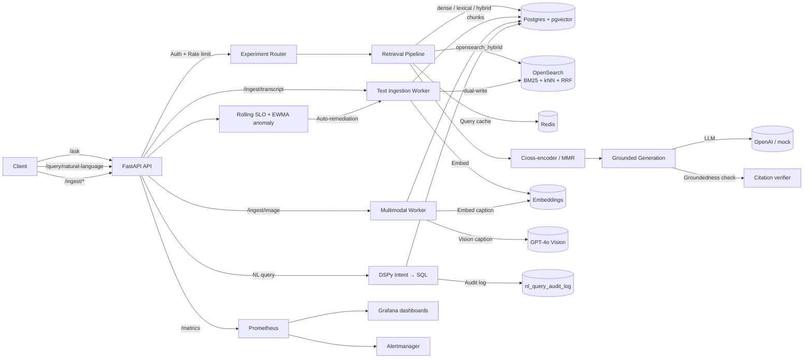

# AI-Native Data Platform

Production-grade RAG platform scaffold demonstrating the engineering patterns used in real AI-native systems: multi-stage retrieval, multimodal ingestion, runtime reliability contracts, DSPy-optimized NL→SQL, OpenSearch hybrid search, and a full Prometheus + Grafana observability stack.

## What's inside

| Subsystem | What it does |
|---|---|
| **Text ingestion** | Idempotent chunking + embedding, chunk-level hash dedup, embedding version tags, dual-write to OpenSearch |
| **Multimodal ingestion** | PDF/image → GPT-4o Vision captions → embeddings stored in `image_chunk` |
| **pgvector retrieval** | Dense (pgvector ANN) + lexical (Postgres FTS) + RRF fusion + MMR reranking |
| **OpenSearch retrieval** | BM25 + kNN vector search + RRF hybrid — runtime-selectable alternative backend |
| **Grounded generation** | Strict JSON schema outputs, citation snippet verification, minimum evidence gate |
| **Reliability contracts** | Runtime SLO guardrails (latency, empty-retrieval, groundedness ≥ 0.70), rolling window SLO, EWMA anomaly detection, leader-elected automated remediation |
| **NL→SQL layer** | DSPy-optimized intent extraction → parameterized SQL → workspace-scoped results |
| **Observability** | Prometheus `/metrics`, 15-panel Grafana dashboard, structured JSON trace logs |
| **Safety** | Prompt injection detection (5 taxonomies), PII redaction, toxicity filtering, audit events |
| **Evaluation** | RAGAS offline eval, CI quality/latency gates, golden dataset, pgvector vs OpenSearch comparison experiments |

## Quickstart

```bash
# Start everything (includes OpenSearch + Dashboards)
docker compose up -d

# Init Postgres schema + seed demo workspace
docker compose exec -T db psql -U app -d app < scripts/init_db.sql

# Init OpenSearch index
python scripts/opensearch_init.py --wait
```

All services come up automatically:

| Service | URL |
|---|---|
| API + Swagger UI | http://localhost:8000/docs |
| Prometheus | http://localhost:9090 |
| Grafana | http://localhost:3000 (admin / admin) |
| OpenSearch | http://localhost:9200 |
| OpenSearch Dashboards | http://localhost:5601 |

Demo credentials for every API call:
```
X-Workspace-Id: demo
X-API-Key: demo
```

## Use case walkthrough

### 1. Ingest a document

```bash
curl -X POST http://localhost:8000/ingest/transcript \
  -H "Content-Type: application/json" \
  -H "X-Workspace-Id: demo" \
  -H "X-API-Key: demo" \
  -d '{
    "workspace_id": "demo",
    "title": "Refund Policy",
    "text": "Customers may request a full refund within 30 days of purchase..."
  }'
# → {"status": "queued", "document_id": "..."}
```

Background worker chunks the text, embeds it, writes vectors to pgvector, and dual-writes to OpenSearch.

### 2. Ask a question (RAG)

```bash
curl -X POST http://localhost:8000/ask \
  -H "Content-Type: application/json" \
  -H "X-Workspace-Id: demo" \
  -H "X-API-Key: demo" \
  -d '{"workspace_id": "demo", "query": "How long do I have to get a refund?"}'
# → {"answer": "30 days...", "citations": [...], "unknown": false}
```

Flow: embed query → Redis cache check → retrieval backend → RRF fusion → rerank → LLM grounded generation → citation verification → SLO trace.
If retrieval returns nothing or groundedness fails → `"unknown": true`, no hallucination.

### 3. Natural language data queries

```bash
curl -X POST http://localhost:8000/query/natural-language \
  -H "Content-Type: application/json" \
  -H "X-Workspace-Id: demo" \
  -H "X-API-Key: demo" \
  -d '{"workspace_id": "demo", "query": "Show failed ingestion runs from today"}'
# → {"sql": "SELECT ... FROM ingestion_run WHERE status = :_v0 ...", "results": [...], "row_count": 2}
```

DSPy BootstrapFewShot optimized against a 20-example golden dataset → safe parameterized SQL → workspace scoped + audit logged.

### 4. Ingest images / PDFs

```bash
curl -X POST http://localhost:8000/ingest/image \
  -H "X-Workspace-Id: demo" -H "X-API-Key: demo" \
  -F "file=@report.pdf"
# → {"status": "queued", "page_count": 5}
```

Each page is vision-captioned, embedded, and retrieved alongside text chunks via a unified UNION query.

## Retrieval backends

The retrieval backend is runtime-selectable via `RETRIEVAL_MODE` or experiment YAML — no code change required.

| Mode | Backend | Description |
|---|---|---|
| `dense` | pgvector | ANN cosine search only |
| `lexical` | Postgres | FTS (tsvector) only |
| `hybrid` | pgvector + Postgres | Dense + lexical, RRF fusion |
| `multimodal` | pgvector | Unified text + image chunk retrieval |
| `opensearch_bm25` | OpenSearch | BM25 lexical only |
| `opensearch_vector` | OpenSearch | kNN vector only |
| `opensearch_hybrid` | OpenSearch | BM25 + kNN, RRF in Python (recommended) |
| `opensearch_hybrid_rerank` | OpenSearch | BM25 + kNN as separate pipeline stages |

### OpenSearch hybrid design

- **Lucene engine** with HNSW (m=16, ef_construction=128, ef_search=128) — no JNI deps, standard JVM GC
- **RRF fusion in Python** — portable across OpenSearch versions, no ML Commons pipeline required
- **Dual-write** after Postgres commit — best-effort, never blocks or fails the main transaction
- **Workspace-scoped** on every query via keyword filter — never optional

## Environment variables

```bash
# LLM + embeddings
OPENAI_API_KEY=sk-...              # required for real embeddings and generation
LLM_PROVIDER=openai                # openai | mock (default: mock)
EMBED_PROVIDER=openai              # openai | mock (default: mock)
OPENAI_CHAT_MODEL=gpt-4.1-mini
OPENAI_EMBED_MODEL=text-embedding-3-small

# Retrieval
RETRIEVAL_MODE=hybrid              # dense | lexical | hybrid | multimodal
                                   # opensearch_bm25 | opensearch_vector | opensearch_hybrid
FUSION_METHOD=rrf                  # rrf | concat
RERANK_MODE=mmr                    # none | mmr | cross
EMBEDDING_VERSION=v1
MULTIMODAL_RETRIEVAL=false

# OpenSearch
OPENSEARCH_URL=http://localhost:9200
OPENSEARCH_INDEX=ai_platform_chunks
OPENSEARCH_DUAL_WRITE=true         # write chunks to OpenSearch on every ingest

# Vision
VISION_PROVIDER=mock               # openai | gemini | mock

# NL query
NL_QUERY_PROVIDER=dspy             # dspy | openai | mock

# Database
DATABASE_URL=postgresql+psycopg2://app:app@db:5432/app
REDIS_URL=redis://redis:6379/0
```

Without `OPENAI_API_KEY` the platform runs fully on deterministic mocks — safe for local dev and CI.

## Architecture


```mermaid
flowchart LR
  Client -->|/ask| API[FastAPI API]
  Client -->|/query/natural-language| API
  Client -->|/ingest/*| API
  API -->|Auth + Rate limit| Router[Experiment Router]
  Router --> R[Retrieval Pipeline]
  R -->|dense / lexical / hybrid| PG[(Postgres + pgvector)]
  R -->|opensearch_hybrid| OS[(OpenSearch\nBM25 + kNN + RRF)]
  R -->|Query cache| Redis[(Redis)]
  R --> Rerank[Cross-encoder / MMR]
  Rerank --> Gen[Grounded Generation]
  Gen -->|LLM| LLM[(OpenAI / mock)]
  Gen -->|Groundedness check| Guard[Citation verifier]
  API -->|/ingest/transcript| Worker[Text Ingestion Worker]
  Worker -->|Embed| Embed[(Embeddings)]
  Worker -->|chunks| PG
  Worker -->|dual-write| OS
  API -->|/ingest/image| MMWorker[Multimodal Worker]
  MMWorker -->|Vision caption| Vision[(GPT-4o Vision)]
  MMWorker -->|Embed caption| Embed
  MMWorker --> PG
  API -->|NL query| NLQ[DSPy Intent → SQL]
  NLQ --> PG
  NLQ -->|Audit log| Audit[(nl_query_audit_log)]
  API -->|/metrics| Prom[Prometheus]
  Prom --> Grafana[Grafana dashboards]
  Prom --> Alert[Alertmanager]
  API --> SLO[Rolling SLO + EWMA anomaly]
  SLO -->|Auto-remediation| Worker
```

## Key design decisions

**Reliability over accuracy.** Every generation call is wrapped in runtime contracts — if retrieval latency spikes or groundedness drops below 0.70, the API degrades to `unknown=true` rather than hallucinating. Safe failure is a first-class requirement.

**DSPy for NL→SQL.** The intent extraction layer uses DSPy BootstrapFewShot rather than a hand-written prompt. Optimized against a 20-example golden dataset; normalization layer handles LLM output quirks (table aliases, column name hallucinations, operator variants, SELECT *, COUNT normalization) before Pydantic validation.

**RRF in Python for OpenSearch hybrid.** OpenSearch's native hybrid search requires ML Commons pipeline setup. Running RRF in Python keeps the implementation portable across OpenSearch versions, fully testable without a running cluster, and easy to tune (bm25_boost, vector_boost, rrf_k all configurable).

**Dual-write is best-effort, post-commit, and insert-gated.** The ingestion loop collects only rows Postgres actually inserted (`ON CONFLICT ... RETURNING id`), then pushes them to OpenSearch in one bulk call after the transaction commits. OpenSearch `_id`s are deterministic (`document_id:chunk_index:embedding_version`), so re-ingestion overwrites instead of duplicating. Failures are logged but never propagate to the API response, and a 30s availability re-probe self-heals after OpenSearch outages.

**Embedding version tags.** Every chunk carries an `embedding_version` field. Re-embedding after a model upgrade is a controlled migration — old and new vectors coexist until the backfill completes.

**Engine cache per DSN.** `app/data/db.py` maintains a single connection pool per database URL, so read replicas and primary share no pool contention. `session_scope(url=None)` routes to primary by default; retrievers pass their own DSN for shard-local queries.

**Mock-first, real-optional.** Every external call (LLM, embeddings, vision, OpenSearch) has a mock or graceful fallback. The entire stack runs without any API key or OpenSearch for local development and CI.

## Observability

The Grafana dashboard at `localhost:3000` (Dashboards → Platform Overview) shows:

- Request traffic: RPS, p50/p95/p99 latency, error rate, 429 rate
- Pipeline latency: retrieval, generation, ingestion
- OpenSearch latency: BM25, vector, hybrid (separate histograms)
- SLO rolling window: error rate, unknown rate, p95 with threshold markers
- Anomaly scores: EWMA z-scores for latency and error drift
- Reliability violations and generation failures
- Ingestion job counts by status

Prometheus scrapes `/metrics` every 10 seconds. Alertmanager rules are in `ops/prometheus/alerts.yml`.

## Testing

```bash
pytest tests/ -v
```

189 tests covering:
- **OpenSearch**: client singleton + availability re-probe, index management, idempotent ingest (deterministic doc ids), BM25/vector/hybrid retrievers, RRF fusion, post-commit batched dual-write
- **Safety**: prompt injection (5 taxonomies), PII redaction (6 types), toxicity filtering
- **NL normalization**: table aliases, column aliases, operator aliases, SELECT * expansion, COUNT(*), idempotency
- **SQL builder**: workspace scoping, all filter operators, ORDER BY, LIMIT, full query shapes
- **Reliability**: SLO contracts, rolling window p95/error/unknown rates, token bucket rate limiter, citation groundedness
- **Chaos**: safe degradation on provider failure, cache miss fallback

No database or OpenSearch instance required — `tests/conftest.py` injects mocks before any import.

## Offline evaluation

```bash
# pgvector baseline
python -m app.eval.run \
  --experiment app/eval/experiments/baseline.yaml \
  --cases app/eval/datasets/cases.jsonl \
  --json_out artifacts/pgvector_results.json

# OpenSearch hybrid challenger
RETRIEVAL_MODE=opensearch_hybrid \
python -m app.eval.run \
  --experiment app/eval/experiments/opensearch_hybrid.yaml \
  --cases app/eval/datasets/cases.jsonl \
  --json_out artifacts/opensearch_results.json
```

CI runs the same harness on every PR (`.github/workflows/eval-gates.yml`) — retrieval quality, groundedness, and P95 latency are non-negotiable deployment constraints.

## GraphRAG extension (future)

`app/retrieval/retrievers/graphrag_stub.py` contains the full design for Neo4j integration:

```
Query → OpenSearch hybrid (seed) → Neo4j graph traversal (2-hop) → cross-encoder rerank → LLM
```

Requires: `NEO4J_URL`, `neo4j` Python driver, entity extraction during ingestion. See the stub for the Cypher query template and implementation notes.

## Scaling and deployment

- `docs/opensearch_design.md` — OpenSearch decision log (engine choice, RRF tradeoffs, dual-write, workspace isolation)
- `docs/deployment_k8s.md` — Kubernetes deployment (replicas, HPA, caching)
- `docs/multi_region.md` — multi-region reference architecture (read-local routing, failover)
- `docs/replica_lag_routing.md` — replica lag handling and read/write routing
- `k8s/istio/` — service mesh policies (mTLS, retries, outlier detection)
- `k8s/networkpolicy.yaml` — network topology hardening
- `ops/prometheus/alerts.yml` — alerting strategy using rolling SLO metrics
- `ops/opensearch/mappings.json` — canonical OpenSearch index mapping
