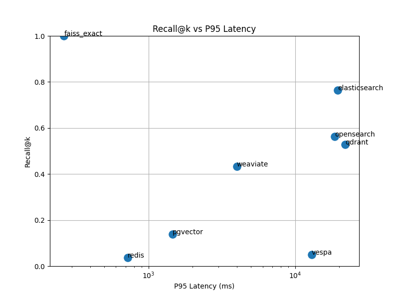
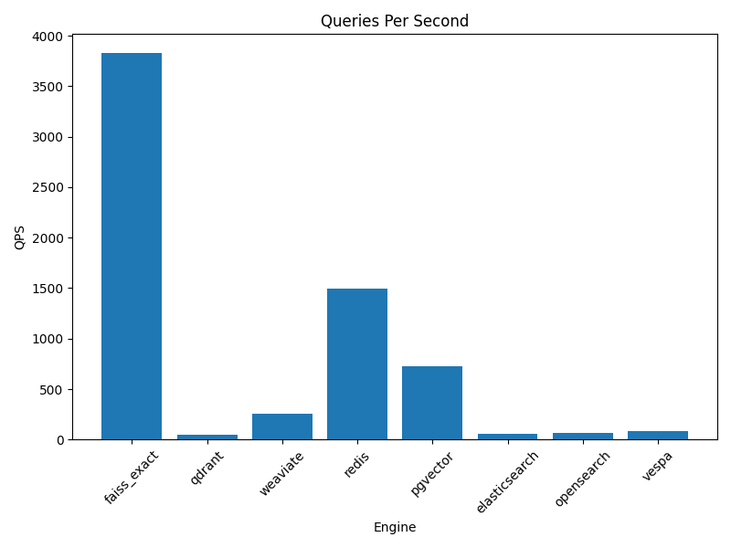

# Vector Arena --- Reproducible Vector Database Benchmark

Vector Arena is a reproducible, single-node benchmark harness for
evaluating modern vector databases and ANN (Approximate Nearest
Neighbor) systems under identical workload conditions.

In a 250k-vector benchmark (dim=128, k=10):

-   ANN engines exhibited \~25× throughput variance
-   Index build time varied \~56×
-   Higher-recall configurations incurred substantial latency cost
-   Throughput-only evaluation proved misleading without recall
    constraints

Designed for empirical infrastructure selection in RAG
(Retrieval-Augmented Generation) and semantic search systems.

------------------------------------------------------------------------

# What This Benchmark Measures

-   Recall@k
-   P50 / P95 / P99 batch latency
-   QPS (queries per second)
-   Recall--latency tradeoffs
-   Index build time

The goal is not to declare a universal winner, but to expose measurable
trade-offs under controlled conditions.

------------------------------------------------------------------------

# Reference Hardware

All included results were generated on:

-   CPU: Intel i5-1135G7 (4C / 8T)
-   Memory: 24GB RAM
-   Storage: NVMe SSD
-   Topology: Single-node

------------------------------------------------------------------------

# Benchmark Methodology

Default workload parameters:

-   Dataset: Synthetic clustered
-   Documents: 250,000 vectors
-   Queries: 1,000
-   Dimensionality: 128
-   Top-K: 10
-   Timed runs: 10
-   Default/light ANN tuning

Engines are evaluated under identical ingestion and query pipelines
using a unified adapter abstraction layer (arena/engines/base.py).

------------------------------------------------------------------------

# Results (Sample Run)

## Recall@k vs P95 Latency



This plot highlights the recall--latency frontier. Higher recall
configurations generally incur increased latency.

------------------------------------------------------------------------

## QPS by Engine



Throughput varies significantly across engines under identical workload
conditions.

------------------------------------------------------------------------

## Comparative Overview


------------------------------------------------------------------------

# Key Findings

-   \~25× throughput variance across ANN engines under identical
    conditions
-   Exact FAISS baseline achieved 100% Recall@k with \~3,824 QPS at
    \~265ms P95
-   Elasticsearch delivered highest ANN recall (\~0.76) with \~19.5s P95
    latency
-   Weaviate achieved \~5× higher throughput and \~4× lower P95 latency
    than Elasticsearch at lower recall
-   \~56× index build-time variance (Vespa vs Qdrant under same dataset)

------------------------------------------------------------------------

# Operational Implications

-   Infrastructure selection must be empirical
-   Recall must be treated as a first-class constraint in RAG systems
-   Index build time materially impacts CI/CD velocity and recovery
    strategies
-   Single-node results do not generalize to distributed scaling

------------------------------------------------------------------------

# Scope & Non-Goals

-   Not a distributed benchmark
-   Not cost-normalized (\$/QPS not measured)
-   Not vendor-maximized tuning
-   Intended for controlled comparison, not marketing claims

------------------------------------------------------------------------

# Requirements

System:

-   Python 3.9+
-   Docker + Docker Compose
-   24GB RAM recommended

Python dependencies:

``` bash
pip install numpy pandas matplotlib scann faiss-cpu
```

------------------------------------------------------------------------

# Running the Benchmark

### Wave 1 --- Vector-native systems

``` bash
docker compose up -d qdrant weaviate redis postgres

python -m arena.bench   --engines faiss_exact,scann,qdrant,weaviate,redis,pgvector   --dataset clustered   --docs 250000   --queries 1000   --dim 128   --k 10   --timed-runs 10   --data-cache-dir .cache
```

### Wave 2 --- Search engines

``` bash
docker compose down
docker compose up -d elasticsearch opensearch vespa

python -m arena.bench   --engines elasticsearch,opensearch,vespa   --dataset clustered   --docs 250000   --queries 1000   --dim 128   --k 10   --timed-runs 10   --data-cache-dir .cache
```

------------------------------------------------------------------------

# Generate Plots

``` bash
python scripts/plot_results.py   --results artifacts/results.json   --out artifacts/plots
```

Artifacts:

-   artifacts/results.json
-   artifacts/results.csv
-   artifacts/results.md
